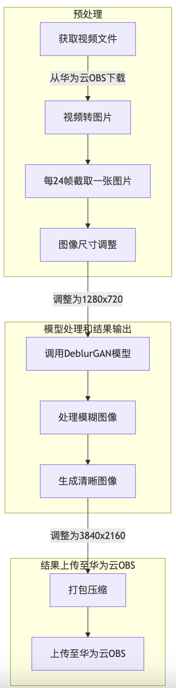

#### 环境配置：

------

软件环境：

```
Python：3.9.2
第三方依赖：opencv，ffmpeg+acllite
CANN >= 5.0.4
华为云OBS创建桶
```

硬件环境：

```
Atlas200DK
```

模型网址：

https://gitee.com/ascend/samples/tree/master/cplusplus/level2_simple_inference/6_other/DeblurGAN_GOPRO_Blur2Sharp

#### 部署

------

注意：请部署在Atlas200DK上。

##### 将obs_getfile.py和obs_upload.py文件中的

```python
obsClient = ObsClient(
        access_key_id='改为自己的',     # obs服务器的key_id
        secret_access_key='改为自己的',  # obs服务器的access_key
        server='改为自己的'   # obs服务器网址
    )
bucketName = "改为自己的" #桶名
```

##### obs_getfile.py

```
# 下载后文件存储到本地的路径
downloadPath = './video_data/video.mp4'
# 下载的文件在OBS中的路径
objectKey = "video/2.MP4"
```

##### obs_upload.py

```
# 定义本地1.zip文件的路径和在OBS存储桶中的文件名
local_ply_path = './1.zip' # 替换为本地1.zip文件的路径
object_key = 'photos/1.zip' # OBS中存储的文件名
```

#### 开始

------

Command

```
python3.9 project_run.py
```

#### 代码流程：


